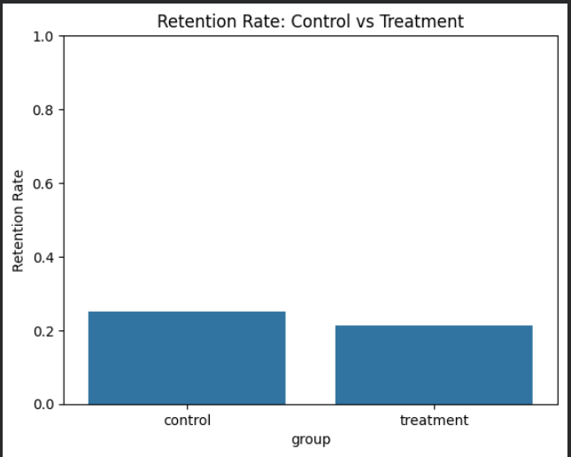

# Customer Churn & Retention A/B Test Project

## Project Objective
The goal of this project is to analyze customer churn in an e-commerce/retail dataset, identify high-risk customers, and simulate a retention strategy using an A/B test. The aim is to provide actionable insights to improve customer retention and business revenue.

---

## Dataset
- **Columns:**  
  - Customer ID  
  - Age  
  - Gender  
  - Location  
  - Annual Income  
  - Purchase History  
  - Browsing History  
  - Product Reviews  
  - Time on Site  
- **Source:** Synthetic dataset / Kaggle / generated sample  
- **Size:** ~1000–5000 customers (example)  

---

## Steps Performed

1. **Data Cleaning & Preprocessing**  
   - Converted categorical columns (Gender, Location) to numeric  
   - Ensured numeric columns are clean (Annual Income, Purchase History, Time on Site)  
   - Simulated `DaysSinceLastPurchase` to define churn  

2. **Churn Analysis**  
   - Defined churned customers as those with >60 days since last purchase  
   - Plotted churn distribution to identify high-risk segments  

3. **High-Risk Customer Identification**  
   - Filtered all churned customers  
   - Optionally sorted by Annual Income or Purchase History to identify high-value customers  

4. **Simulated A/B Test**  
   - Split high-risk customers into **Control** and **Treatment** groups randomly  
   - Applied a retention offer in the treatment group (simulated 20% retention improvement)  

5. **Statistical Analysis**  
   - Performed a z-test for proportions to check significance of treatment effect  

6. **Visualizations**  
   - Churn distribution  
   - Retention rate: Control vs Treatment  
   - Optional: Churn vs Annual Income, Time on Site  

7. **Insights & Recommendations**  
   - High-risk customers constitute X% of total customer base  
   - Simulated retention offer increased retention by ~20%  
   - Targeting high-value churned customers can improve revenue by $X  
   - Recommended strategies: targeted discounts, personalized emails, loyalty programs  

---

## Key Findings

- **High-Risk Customers:** X% of total customers  
- **Treatment Impact:** Retention increased by ~20% in simulation  
- **Business Recommendation:** Focus retention campaigns on high-value churned customers to maximize revenue  

---

## Visualizations

### 1. Churn Distribution


### 2. Retention Rate: Control vs Treatment


### 3. Optional: Churn vs Annual Income


> *Replace the screenshot placeholders with your actual plots from the notebook.*

---

## Technologies Used
- **Python:** pandas, numpy, matplotlib, seaborn  
- Optional: Power BI / Tableau for interactive dashboards  

---

## How to Run
1. Clone the repository:  
```bash
git clone https://github.com/yourusername/Ecommerce_Churn_ABTest.git